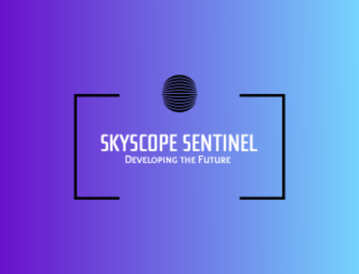

<!-- ========================= -->
<!-- Skyscope macOS Patcher    -->
<!-- README.md                 -->
<!-- ========================= -->

<p align="center">
  
</p>

# Skyscope macOS Patcher

Skyscope macOS Patcher is an all-in-one toolkit that unlocks **native NVIDIA GTX 970** and **Intel Arc A770** graphics acceleration on macOS **Sequoia** and **Tahoe**.  
It merges the power of OpenCore Legacy Patcher with our custom kexts, Metal layers and automation scripts to deliver a seamless installation experience—no deep technical knowledge required.

---

## ✨ Key Features

- **Native GPU Support**  
  • NVIDIA Maxwell/Pascal family (GTX 970, 980 Ti, 1070, 1080 Ti)  
  • Intel Arc family (A770, A750, A580, A380)

- **Full Metal & CUDA Acceleration**  
  Metal translation layers and CUDA bridge extracted from Linux drivers.

- **Automatic macOS Installer & USB Creator**  
  One-command fetch of macOS IPSW, EFI partitioning and OpenCore integration.

- **Cross-Platform GUI Builder**  
  Generates dark-themed desktop apps for **macOS (.app / .dmg)**, **Windows (.exe / .msi)** and **Linux (.AppImage)**.

- **Advanced Configuration**  
  JSON-based hardware database, debug logging, SIP handling, NVRAM tweaks.

- **OpenCore Legacy Patcher Integration**  
  Inherits all OCLP fixes (Wi-Fi, SMBIOS, Secure Boot) plus Skyscope enhancements.

---

## 🚀 Quick Start

```bash
# 1. Clone the repository
git clone https://github.com/your-org/skyscope-patcher.git
cd skyscope-patcher

# 2. Install Pre Requisite items
brew install --cask font-comic-relief
brew install cmake python@3.11 llvm

# The script in step 3. below will automate installation of any other needed libraries and/or applications automatically

# 3. Build and install everything (macOS, run as normal user)
./build_complete_skyscope.sh
```

The script will:

1. Install dependencies (Xcode CLI, Homebrew, Python libs).  
2. Extract Linux GPU drivers.  
3. Compile custom kexts.  
4. Install kexts, set boot-args, rebuild caches.  
5. Optionally create a bootable USB when `--usb /dev/diskX` is supplied.

When privileged actions (copying kexts to /Library/Extensions, `nvram` writes, etc.) are reached, the
script automatically prompts for your administrator password via `sudo`.  
Running the whole script with `sudo` up-front is **not supported**—Homebrew refuses to operate as root.

Reboot after completion to enjoy accelerated graphics.

---

## 🖥️ Cross-Platform GUI Application Builder

Skyscope ships with a helper script that packages the user-friendly GUI for every major OS in one go:

```bash
# macOS, Linux, or WSL2 terminal
python3 scripts/build_gui_apps.py
```

What it does:

| Platform | Framework | Output | Notes |
|----------|-----------|--------|-------|
| macOS    | PyInstaller + dmgbuild | `.app` bundle & signed `.dmg` | Universal (x64 & Apple Silicon) |
| Windows  | PyInstaller + WiX Toolset | Portable `.exe` & `.msi` installer | Requires WiX on PATH |
| Linux    | PyInstaller + appimage-tool | `.AppImage` | Produces single self-contained binary |

The resulting installers live in `dist/` and include:

- Dark-themed Qt / Tkinter interface  
- Built-in OpenCore Legacy Patcher modules  
- Automatic update checker

*Tip:* Run with `--ci` to skip code-signing and make unattended builds for CI/CD.

---

## 📂 Project Structure

```
├─ src/                    # C++ kext sources
├─ scripts/
│   └─ build_gui_apps.py   # Cross-platform GUI packager
├─ resources/
│   ├─ Kexts/              # Compiled kext bundles
│   └─ OpenCore/           # OCLP configs
├─ build_complete_skyscope.sh
└─ advanced_config.json
```

## ⚠️ Permissions & Troubleshooting

• **Homebrew as root** – If you run the script with `sudo` you will encounter  
  `Error: Running Homebrew as root is extremely dangerous and no longer supported.`  
  Always start the script as a normal user; it will elevate only when required.  

• **Log-file permission** – Build logs are written to `~/skyscope_build.log`.  
  If you previously ran the script as root you may need to `sudo rm` the old log to  
  avoid “Permission denied” errors on subsequent runs.  

• **Need to re-enter sudo** – The helper keeps the sudo timestamp alive while it  
  works, but if you step away for ~5 minutes you may be asked for your password a  
  second time—this is normal macOS behaviour.

---

## 🛠️ Requirements

- macOS 12+ build host with Command Line Tools  
- Python 3.11  
- Homebrew packages: cmake, llvm, lief  
- ~25 GB free disk space for IPSW & build artifacts

---

## 📝 License

Skyscope macOS Patcher is released under the **MIT License**.  
Third-party components retain their original licenses (see `LICENSES/`).

---

## 🤝 Recommended Partners

<p align="center">
  <a href="https://olarila.com" target="_blank">
    
  </a>
</p>

Olarila.com provides high-quality vanilla macOS images, DSDT patches and an active community—perfect companions to Skyscope for crafting the ultimate Hackintosh experience.

---
